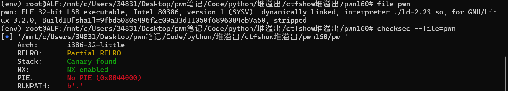
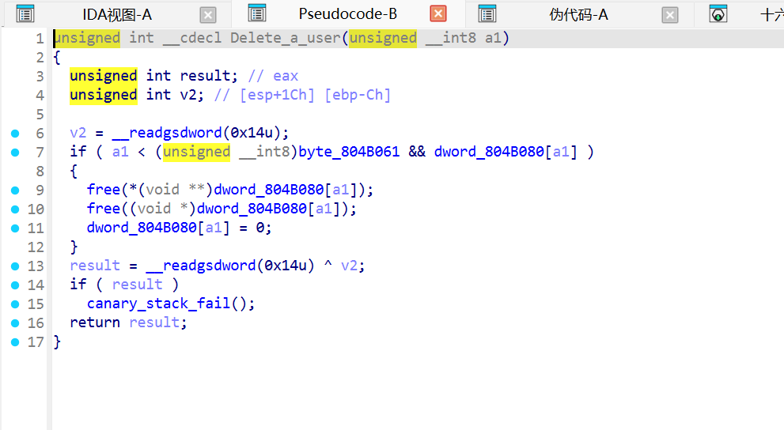
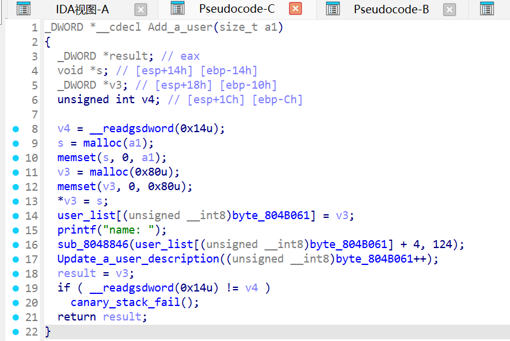
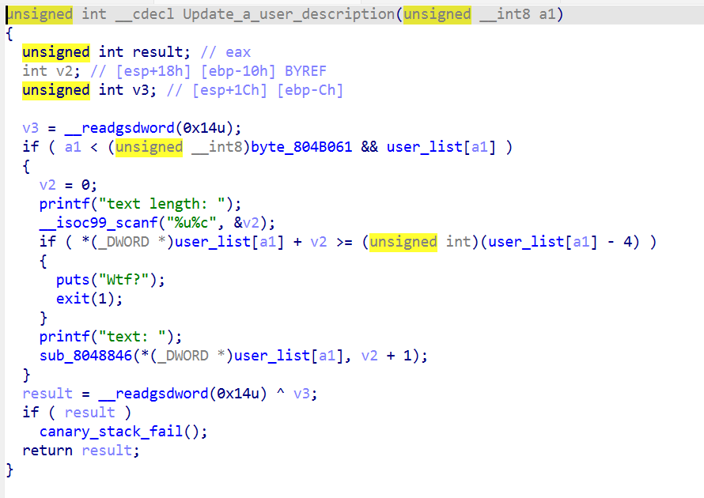
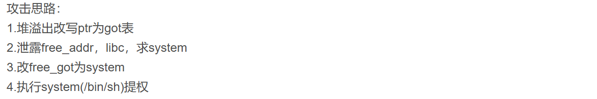
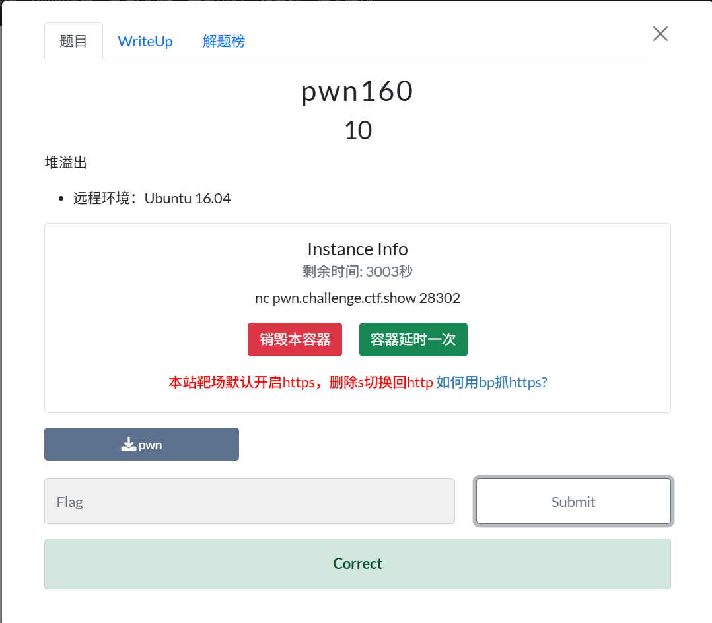

## 附件下载

- [下载题目附件 `pwn`](../../attachments/ctfshow/pwn160/pwn)
- [下载利用脚本 `exp.py`](../../attachments/ctfshow/pwn160/exp.py)


有个指针在删除时没有清零！被空置的指针如果被再次访问会出问题\[确信♥\]其实这题没用到

这里在add_a_user指令中第一次malloc了a1字节(没有做清空)，第二次malloc了0x80字节并清空，两者在内存上是相连的，第一次malloc的chunk0.0是存放name的，第二次malloc的chunk0.1是存放...啥的？v3指针存入了userlist\[x\]指向第x+1位usernamechunk的头地址

如果当前user的chunk头地址+申请的contentchunk大小>=当前chunk的size，puts("wtf")否则存入text。因此chunk0.1是存user给的text的。chunk0.1的前4个字节是存放了前一个chunk的地址，且访问用的都是这个。
这里注意到，如果给v2赋值-1的话，能够绕过检测条件，获得很大一块内存区域的可写权限，可能能够覆盖到user_list列表做double_free。但这题用不了这个。
这题发现Update函数中的判断条件很奇怪，如果chunkx.0和chunkx.1之间隔了几个chunk，那么很轻松就可以做到堆溢出，v2可以申请得很大来覆盖中间一些chunk的chunkn.1的前四字节部分。

tips:
申请两个chunk，一般申请chunk时，有附带的chunk，很大概率是攻击点




实际上，这是道堆风水的题目。
通过申请堆块释放堆块的方式，使同一次申请的两个chunk相隔几个chunk，这样中间的chunk都会“可写”。

# Heap_Overflow WP

  

## 1. 程序与保护

  

- 架构：`ELF 32-bit`

- 保护：`NX`、`Canary`、`No PIE`、`Partial RELRO`

- 功能：

  - `0` 添加用户

  - `1` 删除用户（先 `free(desc)` 再 `free(node)`）

  - `2` 显示用户（`name: %s` / `description: %s`）

  - `3` 更新描述

  

用户结构可还原为：

  

```c

struct user {

    char *desc;      // +0x0

    char name[0x7c]; // +0x4

}; // malloc(0x80)

```

  

## 2. 漏洞点

  

`update` 中边界检查逻辑（反汇编还原）：

  

```c

if (desc_ptr + len >= node_ptr - 4) {

    puts("Wtf?");

    exit(1);

}

fgets(desc_ptr, len + 1, stdin);

```

  

问题是上界用的是 `node_ptr - 4`，而不是 `desc_chunk` 的实际大小。  

当我们让 `desc` 和 `node` 在堆上距离很远时，这个检查就会放行超长写入，导致跨 chunk 堆溢出。

  

## 3. 利用思路

  

1. 先分配 3 个用户：`user0`、`user1`、`user2`（`user2->desc` 写 `/bin/sh`）。

2. `delete(user0)`，形成可复用空闲块。

3. 再 `add` 一个较大 `desc`（`0x100`），复用旧块；新的 `node` 会被分到更远位置。

4. 在这次 `add` 内部自动触发的 `update` 里超长写，覆盖 `user1->desc` 指针为 `free@got`。

5. `display(user1)` 泄露 `free` 实际地址，计算 `system`。

6. `update(user1)` 把 `free@got` 改成 `system`。

7. `delete(user2)` 触发 `system("/bin/sh")`。

  

## 4. 偏移说明

  

覆盖到 `user1->desc` 的偏移受 glibc 对齐影响：

  

- 常见旧环境：`0x198`

- 我本地 WSL glibc 2.39：`0x1b0`

  

`exp.py` 已内置双偏移自动尝试：`0x198 -> 0x1b0`。

  

## 5. EXP

  

脚本见：[exp.py](../../attachments/ctfshow/pwn160/exp.py)

  

本地验证命令：

  

```bash

python3 exp.py CHECK

```

  

成功关键输出（本地实测）：

  

```text

[+] free@libc = 0xf7dec1f0

[+] system = 0xf7d9d430

[+] Exploit succeeded (shell command executed).

```

  

## 6. 复现备注

  

- 该题思路是经典 `free@got -> system`。

- 新版 glibc 有 tcache 时，建议本地调试关闭 tcache：

  - `GLIBC_TUNABLES=glibc.malloc.tcache_count=0`

- `exp.py` 本地模式已自动设置该环境变量（可用 `TCACHE` 参数关闭这个行为）。

Q：wp中，利用思路的第四步执行时，内存空间是怎样的，用什么覆盖了什么，形象地讲解一下


A：对应你 WP 里第 4 步，本质是一次“超长笔划穿多块堆内存”的定向覆盖。

可以把堆想成一排连续房间（低地址 -> 高地址）：

`[ user0.desc ][ user0.node ][ user1.desc ][ user1.node ][ user2.desc ][ user2.node ] ...`

delete(user0) 后，前两个房间被腾空并合并成大空洞。  
接着 add(reclaim, size=0x100) 时：

1. reclaim.desc 被分配进这个大空洞（在前面，低地址）。
2. reclaim.node 因为空洞不够放 0x80 结构体，会去后面再找位置（高地址，通常在 user2 后）。

于是变成：

`[ reclaim.desc(低) ][ user1.desc ][ user1.node ][ user2.desc ][ user2.node ] ... [ reclaim.node(高)]`

关键 bug 在 update 的检查：它拿 reclaim.node 当“上界”，而不是 reclaim.desc 真实长度。  
所以我们传一个很长 text_len（比如偏移 0x198/0x1b0），程序认为“还没越界”，实际 fgets 已经从 reclaim.desc 一路写穿过去。

写入载荷是：

`b"C" * offset + p32(free_got)`

效果是：

- 前面的 C 填满/踩过中间区域；
- 最后 4 字节刚好落在 user1.node 的第一个字段（user1->desc 指针）；
- 把它从“原来指向 user1.desc”改成“指向 free@got”。

所以第 4 步可以形象理解为：  
“拿一支超长记号笔从 reclaim.desc 开始画，画穿中间几间房，最后把 user1 门牌上的地址改成 free@got”。  
后续 display(user1) 就会按这个假地址去读，从而泄露 libc。


